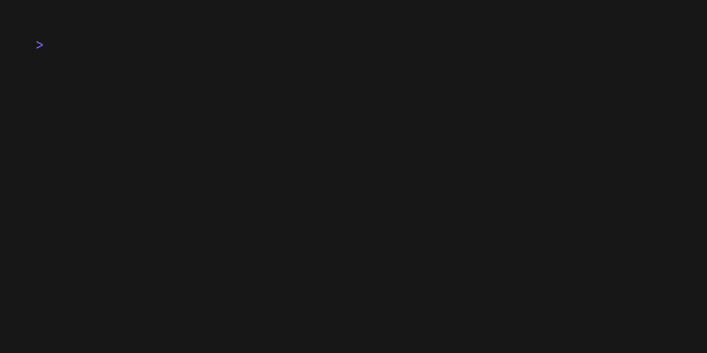

# Regex TUI

A terminal user interface (TUI) application for testing and visualizing regular expressions in real-time.

## Features

- Interactive regex editor with live validation
- Multi-line text input for testing
- Visual highlighting of regex matches with alternating colors
- Real-time feedback as you type the expression
- Clean and intuitive terminal interface
- Tab navigation between regex and text inputs

## Demo



## Installation

### Using go install

The simplest way to install regex-tui is using `go install`:

```bash
go install github.com/vitor-mariano/regex-tui@latest
```

This will install the binary to your `$GOPATH/bin` directory. Make sure this directory is in your `PATH`.

### Manual Installation with Make

Clone the repository and use Make to build and install:

```bash
git clone https://github.com/vitor-mariano/regex-tui.git
cd regex-tui
make install
```

This will compile the application and install it to `$GOPATH/bin/regex-tui`.

## Requirements

- Go 1.25 or later

## Usage

Simply run the command:

```bash
regex-tui
```

The application will launch in full-screen mode with:
- A regex pattern input field at the top (starts with example pattern `[A-Z]\w+`)
- A text input area below (starts with example text "Hello World!")
- Matches highlighted in alternating yellow and blue colors

### Keyboard Shortcuts

- **Tab**: Switch between regex input and text input
- **Esc** or **Ctrl+C**: Exit the application

## Roadmap

- Support highlighting while editing text
- Support PCRE
- Support scroll with long texts

## Development

Other available make targets:

```bash
make run        # Run without installing
make build      # Build the binary locally in bin/regex-tui
make clean      # Remove built binary
make uninstall  # Remove installed binary from $GOPATH/bin
make lint       # Run go vet and go fmt
make demo       # Generate demo GIF using vhs
```

## License

This project is open source and available under the MIT License.
